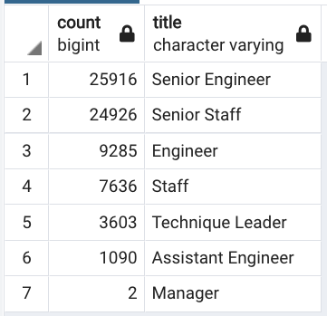
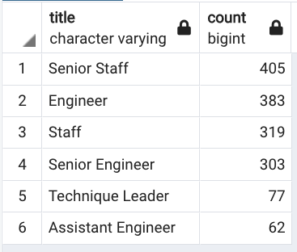

# Pewlett-Hackard-Analysis

## Overview 

Using Postgresql and pgAdmin, an analysis of Pewlett Hackard's employee data. Our goal was to prepare the company for an approaching influx of employees entering retirement. 

In the final part of our analysis, we grouped employees to find the number of retiring employees by title as well as the employees currently eligibile for Pewlett Hackard's mentorship program. 

## Results
Results:
    There is a bulleted list with four major points from the two analysis deliverables. (6 pt)

* 33118 of 36619 or ~90% of current employees are eligible for retirement. 
* Reviewing 'Data/retiring_titles.csv', we can see that the upcoming retirees is primarily comprised of Senior-level empoyees. In particular, Senior Engineers and 'Senior Staff' will be retiring in the near future, which means that knowledge-sharing and education will need to be completed in advance of the exodus. 
* Conversely, the number of Managers retiring is 2. Compared to the 9 total Managers at Pewlett Hackard, this hints that there will still be a healthy management culture after the large-scale retirement event. 

##### Retiring Titles Data

* There are 1549 employees eligible for the Mentorship Program; their information can be found in 'Data/mentorship_eligibility.csv'

## Summary

1. How many roles will need to be filled as the "silver tsunami" begins to make an impact?

As above, 33118 employees are eligible for retirement, meaning this number of roles will need to be filled quickly. 

2. Are there enough qualified, retirement-ready employees in the departments to mentor the next generation of Pewlett Hackard employees?
There are 1549 employees eligible for the Mentorship Program. This is just over 4% of the current headcount at Pewlett Hackard. 

It is a good sign that 708 of those eligible for the Mentorship Program are Senior-level employees, however, swift action will be needed to ensure that training for the next generation of employees occurs soon! 

##### Mentorship Eligibility Counts

